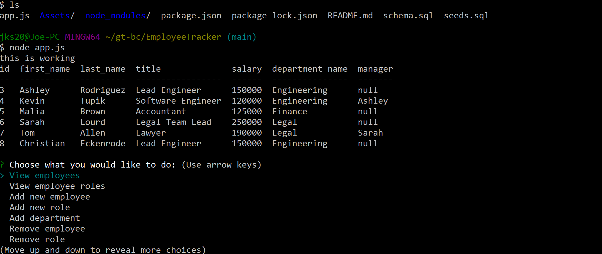

# Employee Tracker
This app manages employees, allowing for adding roles, employees, departments, as well as allowing for deleting of roles, employees, and departments. This app is broken at the moment, because quite frankly I didn't have enough time to figure out most of the complexities, so it is as presented. It can handle deletion and adding, but the updating feature wasn't attempted. 
# Method
This app uses mysql to create a database, and some queries within inquirers to perform deleting and adding. 
# How the app appears
